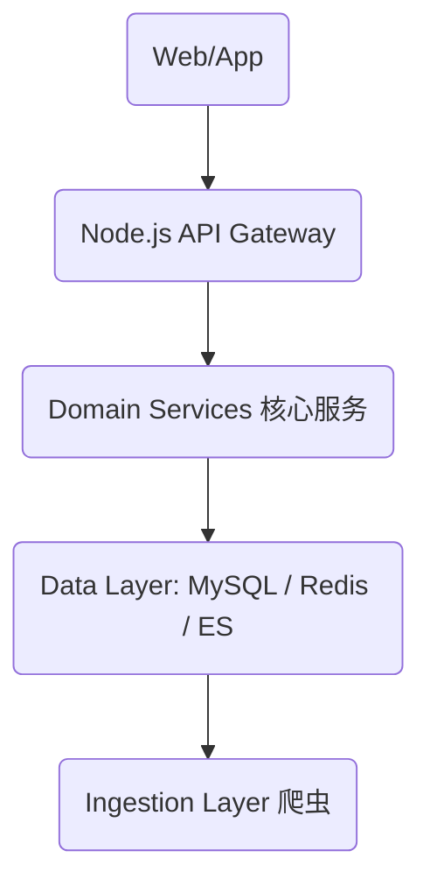

# 一、PRD（大厂级｜可开发）

## 1. 产品定义

- **产品名称**：智能购物决策平台
- **定位**：消费决策系统（Decision Engine）

### 核心目标

帮助用户解决：
- 买不买
- 去哪买
- 什么时候买
- 有没有风险

---

## 2. 用户故事（Jira 级）

- **As a user**
  - I want to compare prices across platforms
  - So that I can choose the cheapest one

- **As a user**
  - I want to see historical price trends
  - So that I know whether current price is low

- **As a user**
  - I want automatic discount calculation
  - So that I know final payable price

- **As a user**
  - I want risk analysis
  - So that I avoid fake products

- **As a user**
  - I want a clear recommendation
  - So that I can decide quickly

---

## 3. 功能需求（字段级）

### 3.1 商品搜索

#### 输入
| 字段 | 类型 |
| :--- | :--- |
| keyword | string |
| url | string |

#### 输出示例
```json
{
  "product_id": 1,
  "name": "iPhone 15",
  "image": "",
  "min_price": 4999
}
```

### 3.2 商品详情（核心）

#### 返回结构
```json
{
  "product": {},
  "skus": [],
  "price_compare": [],
  "price_history": [],
  "coupons": [],
  "risk": {},
  "decision": {}
}
```

#### 模块拆解

**① 价格对比**
```json
{
  "platform": "JD",
  "price": 4999,
  "final_price": 4899
}
```

**② 历史价格**
```json
{
  "date": "2025-01-01",
  "price": 5200
}
```

**③ 优惠**
```json
{
  "type": "coupon",
  "amount": 50
}
```

**④ 风险**
```json
{
  "score": 80,
  "level": "LOW"
}
```

**⑤ 决策（核心）**
```json
{
  "suggestion": "BUY",
  "confidence": 0.85,
  "reason": "接近历史最低价"
}
```

### 3.3 降价提醒
```json
{
  "sku_id": 1,
  "target_price": 4500
}
```

---

# 二、技术架构（大厂级）

## 1. 架构模式

👉 **微服务 + DDD + BFF**

---

## 2. 分层架构



---

## 3. 服务拆分（DDD）

| 服务 | 职责 |
| :--- | :--- |
| product-service | 商品聚合 |
| price-service | 价格历史 |
| coupon-service | 优惠计算 |
| risk-service | 评论分析 |
| decision-service | 决策引擎 |
| alert-service | 提醒 |

---

## 4. 核心数据流

1. **数据采集**：爬虫 → 原始数据 → 清洗 → 商品归一
2. **分析流**：
   - 价格入库 → 历史分析
   - 优惠计算
   - 决策引擎
3. **输出**：API 返回

---

## 5. 缓存设计（重点）

| 数据 | 缓存策略 |
| :--- | :--- |
| 商品详情 | Redis (10min) |
| 价格 | Redis (5min) |
| 决策结果 | Redis (1min) |

---

## 6. 高并发设计

- 🔥 **热点商品缓存**
- ⚖️ **读写分离**
- ⚙️ **异步任务**（价格采集）

---

# 三、数据库设计（生产级）

## 1. 商品表
```sql
CREATE TABLE product (
  id BIGINT PRIMARY KEY AUTO_INCREMENT,
  name VARCHAR(255),
  brand VARCHAR(100),
  category VARCHAR(100),
  main_image VARCHAR(500),
  created_at DATETIME,
  updated_at DATETIME
);
```

## 2. SKU 表（核心）
```sql
CREATE TABLE product_sku (
  id BIGINT PRIMARY KEY AUTO_INCREMENT,
  product_id BIGINT,
  platform VARCHAR(50),
  platform_sku_id VARCHAR(100),
  title VARCHAR(255),
  price DECIMAL(10,2),
  original_price DECIMAL(10,2),
  shop_name VARCHAR(255),
  is_official BOOLEAN,
  created_at DATETIME,
  updated_at DATETIME,
  INDEX idx_product (product_id),
  INDEX idx_platform (platform)
);
```

## 3. 价格历史（高频）
```sql
CREATE TABLE price_history (
  id BIGINT PRIMARY KEY AUTO_INCREMENT,
  sku_id BIGINT,
  price DECIMAL(10,2),
  recorded_at DATETIME,
  INDEX idx_sku_time (sku_id, recorded_at)
);
```

> **👉 后期建议**：分表（按 `sku_id` hash）

---

## 4. 优惠表
```sql
CREATE TABLE coupon (
  id BIGINT PRIMARY KEY AUTO_INCREMENT,
  sku_id BIGINT,
  type VARCHAR(50),
  amount DECIMAL(10,2),
  condition_amount DECIMAL(10,2),
  start_time DATETIME,
  end_time DATETIME
);
```

## 5. 评论表
```sql
CREATE TABLE review (
  id BIGINT PRIMARY KEY AUTO_INCREMENT,
  sku_id BIGINT,
  rating INT,
  content TEXT,
  created_at DATETIME
);
```

## 6. 风险评分
```sql
CREATE TABLE risk_score (
  sku_id BIGINT PRIMARY KEY,
  score INT,
  comment_abnormal BOOLEAN,
  sales_abnormal BOOLEAN,
  updated_at DATETIME
);
```

## 7. 降价提醒
```sql
CREATE TABLE price_alert (
  id BIGINT PRIMARY KEY AUTO_INCREMENT,
  user_id BIGINT,
  sku_id BIGINT,
  target_price DECIMAL(10,2),
  created_at DATETIME
);
```

---

# 四、决策引擎（核心）

### 输入
- 当前价格
- 历史最低价
- 优惠力度
- 风险评分

---

### 评分模型
**计算公式**：
`score = 价格分(40%) + 历史位置(30%) + 优惠(15%) + 风险(15%)`

### 输出规则
- **score > 80** → `BUY` (建议购买)
- **50 ~ 80** → `WAIT` (等待时机)
- **< 50** → `AVOID` (避雷)
